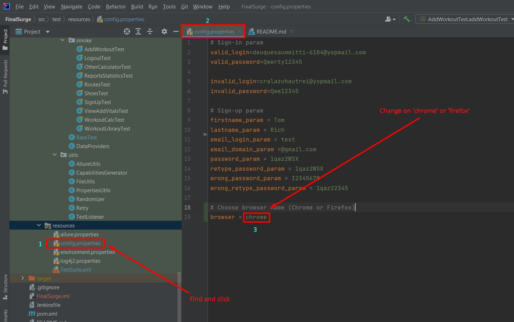

# Website: [FinalSurge](https://log.finalsurge.com/)

### Foreword:
Our framework is **crossbrowser**. Therefore, if you want to use a specific browser,
then you need to change the name of the browser in the code: (Image 1)
  


### TestNg command for run
**Command to run all tests:**
```
mvn clean test
```
**Command to run Smoke tests:**
```
mvn clean test -Dgroups="smoke"
```
**Command to run Negative tests:**
```
mvn clean test -Dgroups="negative"
```
  
### Allure command for run
**Command to run Allure on browser:**
```
mvn allure:serve
```
**Command to run Allure on project:**
```
mvn allure:report
```
  
### Tests documentation


| ID  | Cases                                                   | Status |
|-----|---------------------------------------------------------|--------|
|1    |Registration (+ negative tests)                          |done    | 
|2    |Authorization(+ negative tests)                          |done    |
|3    |Add workout                                              |done    |
|4    |Add new workout to library                               |done    |
|5    |View report by the dates (+ negative tests)              |done    |
|6    |View report by the dates and activity type               |done    |
|7    |Add vitals(+some negative tests)                         |done    |
|8    |Add new shoe                                             |done    |
|9    |Add new routes                                           |done    |
|10   |Check workout calculator (tab “Intensity”)               |done    |
|11   |Check other calculator (tab “Pace calculator”)           |done    |
|12   |Log out                                                  |done    |
